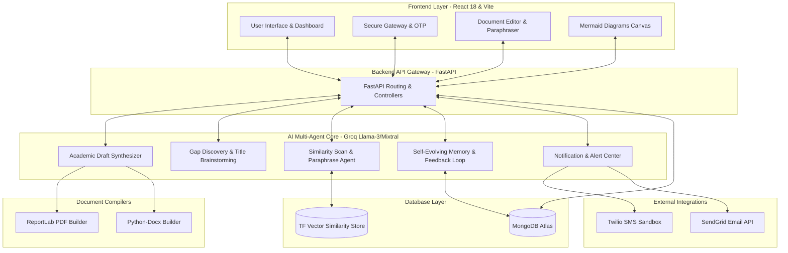

# Self-Evolving Multi-Agent AI Research Assistant

## System Architecture

The architecture is divided into a modern React frontend, a FastAPI routing gateway, and a powerful Groq-powered multi-agent AI core, supported by cloud databases and external communication services.




A futuristic, production-style, AI-powered multi-agent research coordination platform. Designed to help students, developers, professors, and researchers synthesize academic manuscripts, brainstorm innovative concepts, audit duplicate similarity percentages, generate systems architecture flowcharts, dispatch Twilio/SendGrid updates, and dynamically self-evolve using localized feedback learning matrices.

---

## 🌟 Key Features

1. **🔒 Secure gateway auth & OTPs**
   - Seamless email/password synchronization.
   - Segmented cryptographic phone PIN verification (simulating Twilio SMS dispatch).
2. **📚 Academic paper drafts synthesizer**
   - Synthesizes Abstract, Introduction, Lit Survey, Methodology, System Architecture, Experimental Results, Conclusions, Future Scope, and references.
   - Formats to IEEE, Springer, Standard Journal, Conference, or College templates.
   - Backed by automated PDF compiler (ReportLab) and Word DOCX builder.
3. **💡 Gap Discovery Engine**
   - Brainstorms title directions based on domain filters.
   - Highlights academic database gaps, innovations, future expansion metrics, and maps competitor complexity levels.
4. **🛡️ Similarity Scan & Paraphraser**
   - Executes precise string checks against corpora.
   - Color-coded HSL radial percentage gauges indicating duplication ratios.
   - Dual-window comparative paraphrasing editor reducing similarity indexes strictly under the 10% ceiling.
5. **📊 flowcharts & Systems Canvas**
   - Translates descriptive instructions into production-grade Mermaid.js layout codes.
   - Features a live editable syntax terminal on the left and a responsive vector node rendering canvas on the right.
6. **🧠 Self-Evolving Memory Loops**
   - Extracts design constraints and preferences from user text feedback and rating weight scales.
   - Derives adaptive system directives stored in MongoDB and injects them dynamically into LLM prompts for subsequent requests.
7. **✉️ Alert Center & Logs**
   - Audits WhatsApp alerts (Twilio Sandbox) and Email attachments delivery (Sendgrid).

---

## 🛠️ Technology Stack

- **Frontend**: React 18, Tailwind CSS, Framer Motion, Lucide Icons, Vite Bundler.
- **Backend**: FastAPI, Python 3.10, Uvicorn Server.
- **AI Core**: Groq SDK (Llama-3 & Mixtral models orchestration), adaptive memory parser.
- **Database & Storage**: MongoDB Atlas database collections, lightweight term-frequency vector similarity store.
- **Document Compiling**: ReportLab PDF document builder, python-docx library.
- **Deployment**: Docker containerization, Docker Compose.

---

## 📂 Repository Structure
 
```
self-evolving/
├── backend/
│   ├── main.py                  # FastAPI Application Entrypoint
│   ├── config.py                # Configurations loader
│   ├── database.py              # MongoDB async connection & resilient fallbacks
│   ├── models.py                # Pydantic schemas (Auth, Papers, Ideas, Diagrams)
│   ├── routes/                  # API routers (auth, papers, ideas, plagiarism, memory)
│   ├── services/                # Core operations (auth services, agents orchestration, compilers)
│   ├── requirements.txt         # Python libraries
│   └── Dockerfile               # Backend docker layers
├── frontend/
│   ├── package.json             # Node dependencies
│   ├── tailwind.config.js       # Tailwind CSS custom themes
│   ├── index.html               # Main mounting HTML
│   ├── src/                     # React core files (main, App, index.css)
│   │   ├── components/          # Reusable UI (Sidebar, Toasts, GlassCard, AgentMonitor)
│   │   └── pages/               # Functional pages (Landing, Login, Dashboard, Generators)
│   └── Dockerfile               # Frontend docker layers
├── docker-compose.yml           # Multi-container orchestration
└── README.md                    # System documentation
```

---

## 🚀 Getting Started

### Prerequisites
- Node.js (v18+)
- Python (v3.10+)
- Docker & Docker Compose (optional for container launches)

---

### Method A: Quick Local Launch

#### 1. Setup Backend APIs
1. Navigate to the backend directory:
   ```bash
   cd backend
   ```
2. Create and fill in your `.env` configuration file (copy template from `.env.example`). Prefilled developer mock defaults will let you execute simulations immediately without paid keys!
3. Create a python virtual environment and activate it:
   ```bash
   python -m venv venv
   # On Windows:
   venv\Scripts\activate
   ```
4. Install dependencies:
   ```bash
   pip install -r requirements.txt
   ```
5. Run the FastAPI development server:
   ```bash
   python main.py
   ```
   *The API gateway will launch on: [http://localhost:8000](http://localhost:8000)*

#### 2. Launch React Frontend
1. Navigate to the frontend directory:
   ```bash
   cd ../frontend
   ```
2. Install npm modules:
   ```bash
   npm install
   ```
3. Boot the Vite hot-reloading dev bundle:
   ```bash
   npm run dev
   ```
   *The visual dashboard will launch on: [http://localhost:3000](http://localhost:3000)*

---

### Method B: Unified Docker Compose Launch

Deploy the entire stack in isolated network nodes in one command:
```bash
docker-compose up --build
```
- **React Frontend**: [http://localhost:3000](http://localhost:3000)
- **FastAPI Backend**: [http://localhost:8000](http://localhost:8000)

---

## 💡 Operational Walkthrough

1. **Establish Node Tunnel**: Open the LoginPage, choose Email login or toggle OTP. If entering OTP, write a dummy phone (e.g. `+15551234567`) and click Request. A glowing green alert will display the simulated pin (or use fallback code `123456`).
2. **Synthesize a Manuscript**: Navigate to the **Research Generator**, write a title, select a template (e.g., IEEE), and click Compile. The **AI Agent Activity Monitor** will live-render the active agents grid (Research, Plagiarism, Notifications, Memory) alongside scrolling compiler logs.
3. **Train the Self-Evolving Memory**: Read the sections in the viewer. Scroll down to "Teach the Evolving AI". Write a critique like *"Explain methodology in greater detail and include mathematical notations"*. Click submit. The Memory Agent instantly registers a new rule, viewable in the **Memory Profile** settings page!
4. **Audit and Paraphrase Text**: Paste a copied paragraph into the **Originality Audit** page, then click scan. Click the "Trigger Agent Auto-Rewrite" button and inspect the side-by-side rephrased windows showing the duplicate percentage drop safely below 10%.
5. **visualize architectures**: Describe your network on the **Diagram page**. Click Compile to view the parsed systems graph and edit the Mermaid script lines live to watch the nodes repaint dynamically.
6. **Dispatch Audits**: Configure channel toggles on the **Alert Hub** page, send a test update, and scroll down to audit delivery timestamps, recipients, and statuses.
# self-evolving-agent

