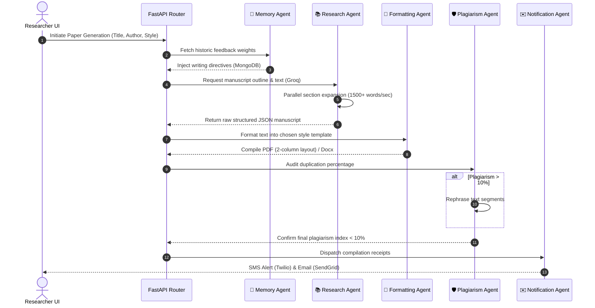

# Self-Evolving Multi-Agent AI Research Assistant
An advanced AI-powered platform for academic manuscript generation and research topic brainstorming. Powered by a coordinated network of specialized LLM agents, it synthesizes fully formatted drafts (Abstract to References), audits similarity indices, visualizes system architectures, and dynamically self-evolves using persistent localized feedback learning loop matrices.

---

## 💡 Problems Solved

Traditional AI generators suffer from repetitive phrasing, rigid styling templates, and lack of dynamic user tailoring. This project introduces core technical engineering solutions to these challenges:

### 1. LLM Repetition & Word-Count Bottlenecks
* **Problem**: Standard LLMs (like Llama) enter loop cycles or return redundant phrasing when instructed to write long, detailed academic articles (1500+ words per section).
* **Solution**: The orchestrator decouples generation into a multi-step pipeline. It first builds a structured outline, then executes parallel section-by-section expansions using customized context prompts, forcing deep mathematical, architectural, and analytical sub-sections without redundancy.

### 2. Rigid Academic PDF Formatting (IEEE Two-Column Standard)
* **Problem**: ReportLab standard flows do not natively support switching from single-column title sections (containing side-by-side author details) to rigid two-column content layouts on the fly.
* **Solution**: Custom table flowables and dual-pass compilers align author bios side-by-side (in grids of up to three) and dynamically balance column heights across multi-page layouts.

### 3. Plagiarism & Originality Index Compliance
* **Problem**: Automated content synthesis frequently registers high similarity index checks against public databases and corpora.
* **Solution**: Real-time vector-based similarity checks scan generated text. If similarity indexes exceed a strict 10% ceiling, a specialized **Rewrite Agent** restructured the semantic representation side-by-side to guarantee originality.

### 4. API & Database Resiliency
* **Problem**: Missing API keys (Groq, Twilio, SendGrid) or disconnected databases (MongoDB Atlas) break standard FastAPI routines.
* **Solution**: Features a robust `InMemoryDB` fallback class and simulated mock model responses, allowing developers to execute local simulation suites offline.

---

## 📊 Coordinated Multi-Agent Workflow



### Step-by-Step Execution Lifecycle:
1. **Retrieve Memory Rules**: The **Memory Agent** queries MongoDB to parse qualitative feedback ratings from past generations, configuring system instructions.
2. **Draft & Expand Content**: The **Research Agent** (using `Llama-3.3-70b-versatile`) writes abstract nodes, structures bibliography lists, and performs parallel essay expansion of sections (Problem Statement, Methodology, System Design, Results).
3. **Compile Layouts**: The **Formatting Agent** maps documents to styling conventions. Using ReportLab, it compiles dual-column layouts and aligns author boxes side-by-side.
4. **Audit and Paraphrase**: The **Plagiarism Agent** checks sentences against local vector databases. If flags are raised, it triggers a rewrite loops to lower similarity metrics below 10%.
5. **Render Architecture Models**: The **Diagram Agent** translates systems descriptions into responsive Mermaid.js syntax code.
6. **Dispatch Status Notifications**: The **Notification Agent** posts alert tracking logs via Twilio SMS (Sandbox environment) and SendGrid Email networks.

---

## 🛠️ Technology Stack

* **Frontend**: React 18, Tailwind CSS, Framer Motion, Lucide Icons, Vite Bundler.
* **Backend**: FastAPI, Python 3.11, Uvicorn ASGI Server.
* **AI Engine**: Groq SDK (`Llama-3.3-70b-versatile` & `Llama-3.1-8b-instant`), adaptive memory prompt parser.
* **Database & Storage**: MongoDB Atlas database collections (with resilient `InMemoryDB` fallback if Atlas is offline), term-frequency vector similarity store.
* **Document Compiling**: ReportLab PDF document builder, python-docx library.
* **Deployment**: Docker containerization, Docker Compose, Render (Backend API), Vercel (Frontend Client).

---

## 📂 Project Structure
```
SELF-EVOLVING/
├── backend/
│   ├── routes/                     # FastAPI endpoint routing
│   │   ├── auth.py                 # Users & OTP simulations
│   │   ├── dashboard.py            # Overview charts & metrics
│   │   ├── diagrams.py             # Mermaid visualizer routing
│   │   ├── ideas.py                # Research gap analyzer
│   │   ├── memory.py               # Evolving profiles rules
│   │   ├── notifications.py        # Twilio & SendGrid logs
│   │   ├── papers.py               # Synthesis queue & downloaders
│   │   └── plagiarism.py           # Similarity auditing & rewrites
│   ├── services/                   # Compiler, auth, and agent tasks
│   │   ├── agents.py               # LLM system prompts
│   │   ├── pdf_docx.py             # ReportLab & docx compilers
│   │   └── pdf_parser.py           # PyPDF2 extraction helpers
│   ├── main.py                     # Backend API entrypoint
│   ├── config.py                   # Dotenv configurations
│   ├── database.py                 # MongoDB + InMemory resilient fallback db
│   ├── requirements.txt            # Python dependencies
│   └── Dockerfile                  # Backend docker layers
├── frontend/
│   ├── src/                        # React frontend structure
│   │   ├── components/             # Sidebar, glass layouts, toasts
│   │   └── pages/                  # Route views (Dashboard, Generator, Audit...)
│   │       ├── Dashboard.jsx
│   │       ├── DiagramGenerator.jsx
│   │       ├── IdeaSearch.jsx
│   │       ├── LandingPage.jsx
│   │       ├── LoginPage.jsx
│   │       ├── NotificationCenter.jsx
│   │       ├── OtpPage.jsx
│   │       ├── PaperGenerator.jsx
│   │       ├── PlagiarismPage.jsx
│   │       └── UserProfile.jsx
│   ├── package.json                # Frontend npm configuration
│   └── vercel.json                 # Vercel deployment proxy configuration
├── docker-compose.yml              # Multi-container local boot
└── README.md                       # Project documentation
```

---

## 🚀 Quick Start

### 1. Install Dependencies
```bash
# Setup backend libraries
cd backend
python -m venv venv
venv\Scripts\activate  # Windows
source venv/bin/activate  # macOS/Linux
pip install -r requirements.txt

# Setup frontend libraries
cd ../frontend
npm install
```

### 2. Run Locally
```bash
# Run FastAPI server (Port: 8000)
cd backend
python main.py

# Run React dashboard (Port: 3000)
cd ../frontend
npm run dev
```

### 3. Access Dashboard
Navigate to `http://localhost:3000` to start modeling.

---

## ☁️ Cloud Deployment Configuration

### 1. Render Setup (FastAPI Backend)
Deployed automatically using `render.yaml`.
* **Build Command**: `cd backend && pip install -r requirements.txt`
* **Start Command**: `cd backend && uvicorn main:app --host 0.0.0.0 --port $PORT`
* **Key Env Vars**: `GROQ_API_KEY`, `MONGODB_URI`

### 2. Vercel Setup (React Frontend)
Uses the rewrite proxy configuration (`vercel.json`) to direct all `/api/*` endpoints to the Render backend url:
```json
{
  "rewrites": [
    {
      "source": "/api/(.*)",
      "destination": "https://self-evolving-agent-1.onrender.com/api/$1"
    },
    {
      "source": "/(.*)",
      "destination": "/index.html"
    }
  ]
}
```

---

## 🛡️ Academic Disclaimer
This system is an AI-powered assistant designed for draft synthesis and brainstorming. Generated manuscripts and citations should be checked for accuracy and academic integrity before submission to publications.
